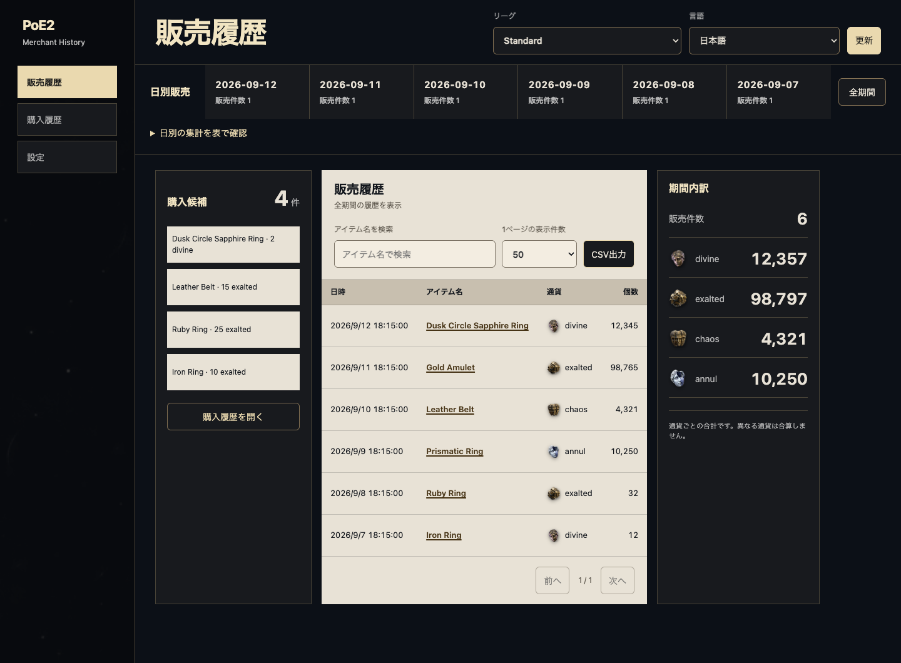
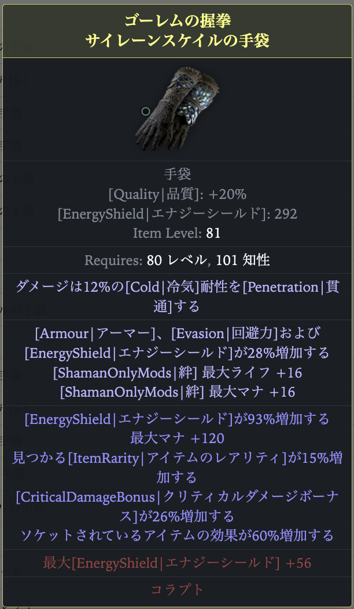

# PoE2 Merchant History

Chrome extension that stores Path of Exile 2 merchant sales history per league and visualizes it with charts and tables. Data is kept locally for aggregation and comparison.

[日本語README](README.md)

## Key Features

- Fetch and switch league list
- Manual refresh to pull history (adds diffs only, limited to once per minute)
- Daily and currency line charts
- Currency totals summary
- History list (search, pagination, detail modal)
- Export history list to CSV
- Cookie status display (options)

## Setup

1. Download the latest `extension-*.zip` from [Releases](https://github.com/bagpack/poe2-merchant-history/releases)
2. Extract the downloaded zip to any folder
3. Open `chrome://extensions/` in Chrome
4. Enable Developer Mode
5. Click "Load unpacked"
6. Select the extracted folder

## Development Docs

Build-from-source and development details are maintained in Japanese only:  
`docs/development.md`

## Usage

1. Click the extension icon to open the tab
2. Select a league
3. Click the "Update" button to fetch history
4. Review history in charts, totals, and list

## Notes

- Requires the `jp.pathofexile.com` login cookie (POESESSID)
- Fetching is limited to once per minute
- The official API only returns about the latest 100 records, so periodic saves are useful
- Data is stored per league in IndexedDB and kept indefinitely

## Screenshot

