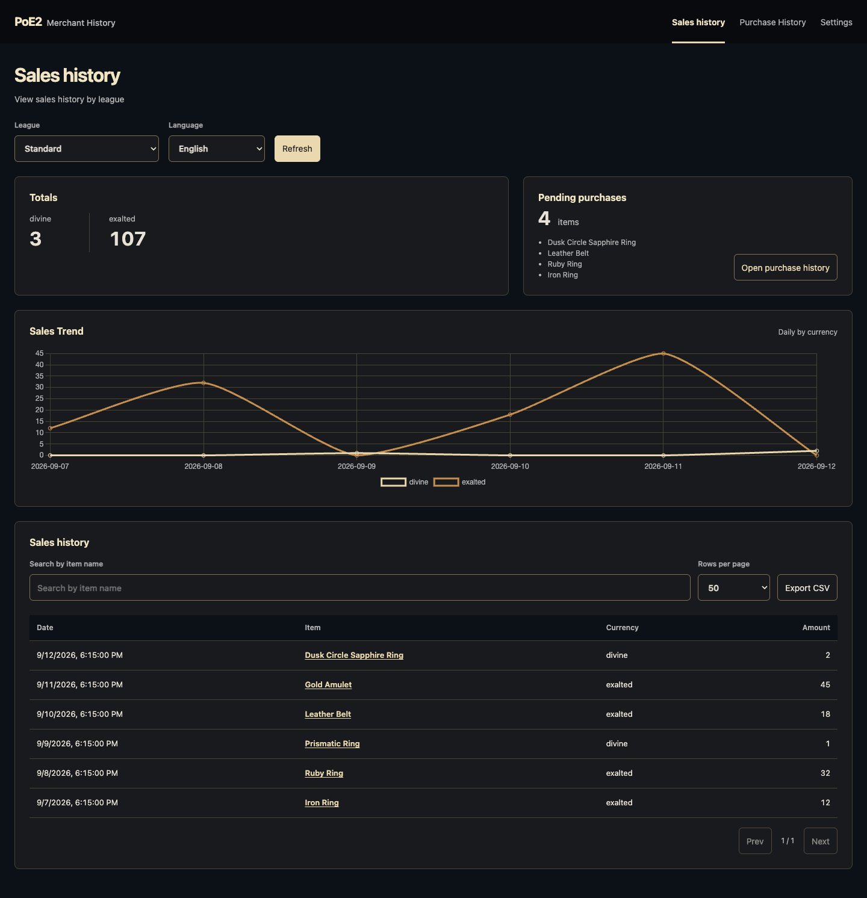
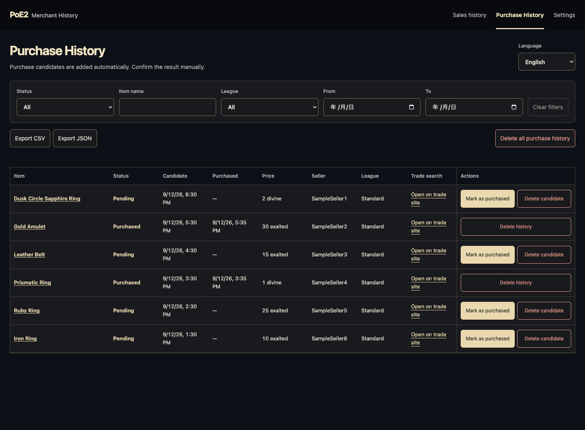
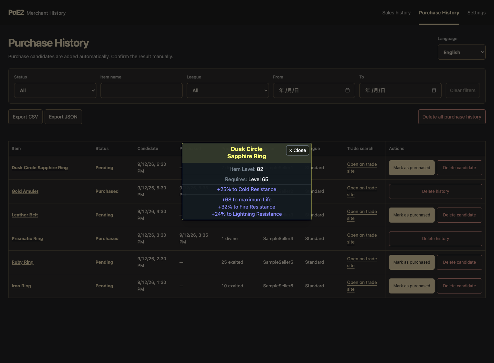

# PoE2 Merchant History

A Chrome extension for managing Path of Exile 2 sales and purchases.

[日本語](README.md)

## Features

- Search sales and review currency totals and charts
- Organize purchase candidates and mark them as purchased, with 30-second undo
- View item details, export history, and back up data
- English and Japanese support

Instant-purchase actions on the official trade site add candidates. Confirm the purchase outcome manually.

## Install

1. Download `extension-*.zip` from [Releases](https://github.com/bagpack/poe2-merchant-history/releases) and extract it
2. Open `chrome://extensions/` and enable Developer Mode
3. Click "Load unpacked" and select the extracted folder

Sign in to the official site, open the extension, select a league, and click "Refresh" to fetch sales history.

## Screenshots

Images use sample data. Published releases may differ in appearance or features.

### Sales History

### Purchase History

### Item Details

