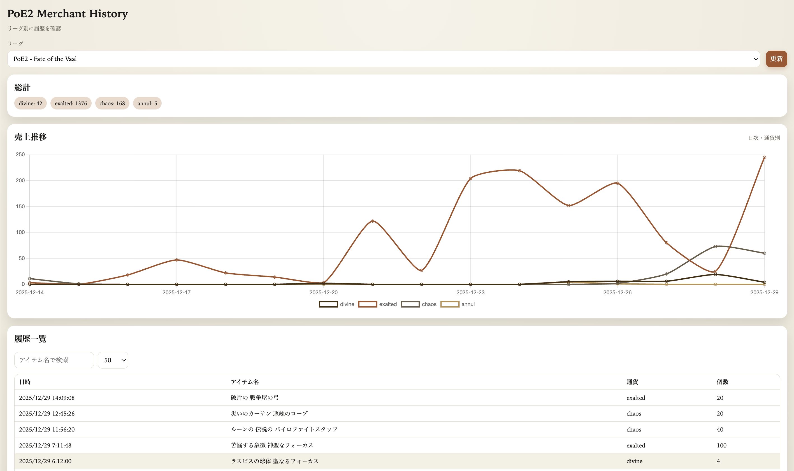

# PoE2 Merchant History

PoE2の売上履歴をリーグ別に保存し、グラフと表で可視化するChrome拡張です。履歴をローカルに保持し、集計・比較を可能にします。

[English README](README.en.md)

## 主な機能

- リーグ一覧の取得と切り替え
- 手動更新で履歴を取得（差分のみ追加、1分に1回の制限）
- 日次・通貨別の折れ線グラフ
- 通貨別合計の表示
- 履歴一覧（検索、ページング、詳細モーダル）
- 履歴一覧をCSVで出力
- Cookie状態の表示（options）

## セットアップ

1. Chromeで `chrome://extensions/` を開く
2. 右上の「デベロッパーモード」をON
3. 「パッケージ化されていない拡張機能を読み込む」をクリック
4. このリポジトリのフォルダを選択

## 使い方

1. 拡張アイコンをクリックしてタブを開く
2. リーグを選択
3. 「更新」ボタンで履歴を取得
4. グラフ・総計・一覧で履歴を確認

## 注意点

- 取得には `jp.pathofexile.com` のログインCookie（POESESSID）が必要です
- 取得は1分に1回の制限があります
- データはリーグごとにIndexedDBへ保存され、無期限で保持されます

## スクリーンショット

