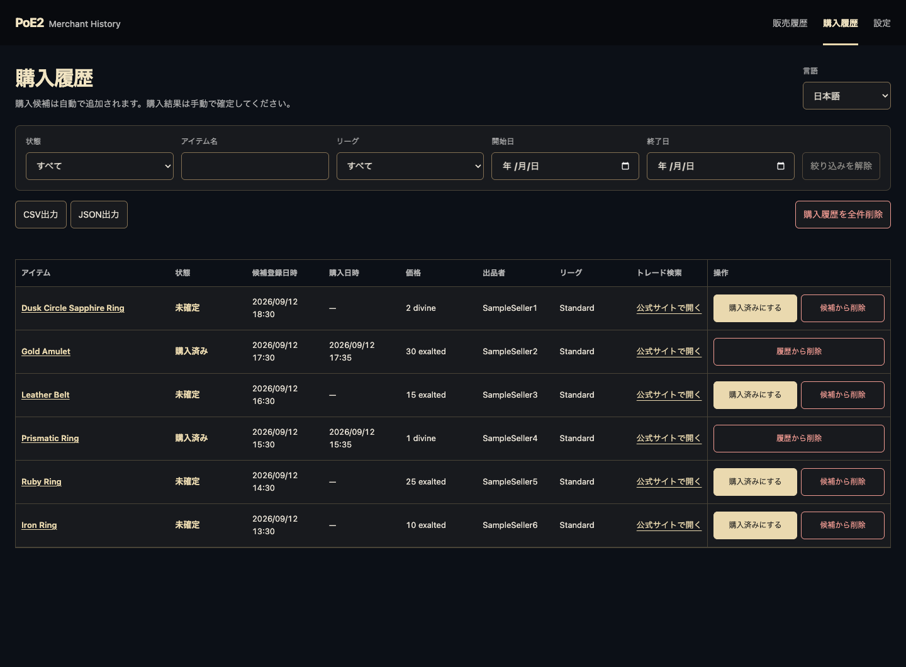

# PoE2 Merchant History

Path of Exile 2の販売・購入履歴を管理するChrome拡張です。

[English](README.en.md)

## できること

- 販売履歴を検索し、通貨別の総計・グラフを確認
- 購入候補を整理し、購入済みに変更（30秒以内なら取り消し可能）
- アイテム詳細の表示、履歴の出力、バックアップ
- 日本語・英語に対応

購入候補は公式トレードサイトの即時購入操作で追加されます。購入結果は手動で確定してください。

## インストール

1. [Releases](https://github.com/bagpack/poe2-merchant-history/releases) の `extension-*.zip` をダウンロードして展開
2. Chromeで `chrome://extensions/` を開き、「デベロッパーモード」をON
3. 「パッケージ化されていない拡張機能を読み込む」から展開したフォルダを選択

公式サイトにログイン後、拡張アイコンからリーグを選び、「更新」で販売履歴を取得できます。

## 画面

画像はサンプルデータです。配布版とは表示や機能が異なる場合があります。

### 販売履歴

### 購入履歴

### アイテム詳細

